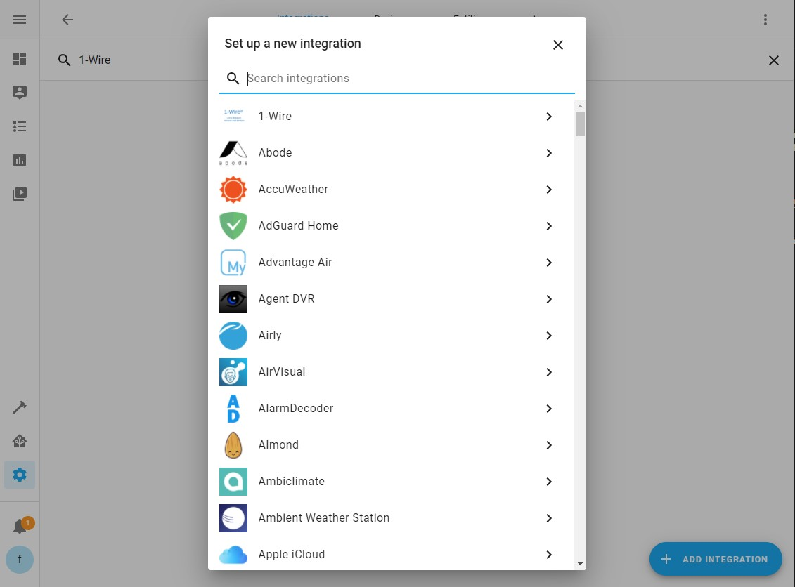
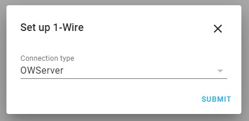
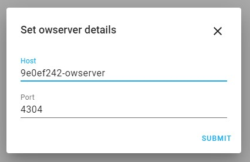
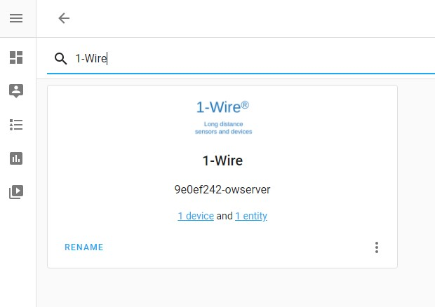
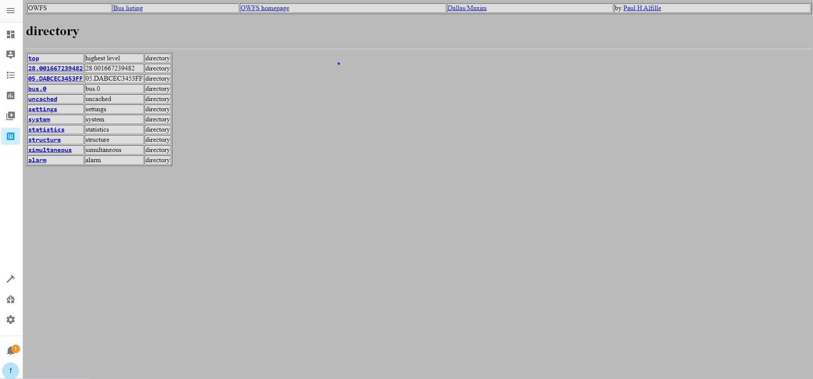

# Home Assistant Add-on: owserver

[![Releases][version]][releases]

![amd64][amd64-shield]
![aarch64][aarch64-shield]
![armhf][armhf-shield]
![armv7][armv7-shield]
![i386][i386-shield]

Provides owserver to read 1-Wire devices over DS2480B-based bus master serial device.

## About

This addon provides you owserver instance to read 1-Wire devices over DS2480B-based bus master serial device and exposing reading to Home Assistant via the native integration. Addon has been tested with **[MERA-PROJEKT MP00206-P](http://www.meraprojekt.com.pl/mp00206-p.html)** but shoud work well with other devices based on DS2480B chip.

## Installation

1. Access your Home Assistant, go to **Supervisor** -> **Add-on Store** and add this URL as an additional repository: `https://github.com/lrybak/hassio-owserver`
2. Find the "owserver (1-Wire)" add-on and click the "INSTALL" button.
3. Configure the add-on and click on "START". With default configuration addon starts with fake (mocked) devices.
4. Add to Home Assistant through the Integrations. Go to Integrations, Add Integration, Choose 1-Wire, Connection type: OWServer, Host: 9e0ef242-owserver, Port 4304 (default).
5. That's it. On the integrations page wou will find 1-Wire integration with discovered devices.

## Configuration

Please check the **[documentation](https://github.com/lrybak/hassio-owserver/blob/master/owserver/DOCS.md)** page.

## Screenshots

[version]: https://img.shields.io/badge/version-v0.2.0-blue.svg
[releases]: https://github.com/lrybak/hassio-owserver/releases

[amd64-shield]: https://img.shields.io/badge/amd64-yes-green.svg
[aarch64-shield]: https://img.shields.io/badge/aarch64-yes-green.svg
[armhf-shield]: https://img.shields.io/badge/armhf-yes-green.svg
[armv7-shield]: https://img.shields.io/badge/armv7-yes-green.svg
[i386-shield]: https://img.shields.io/badge/i386-no-red.svg
